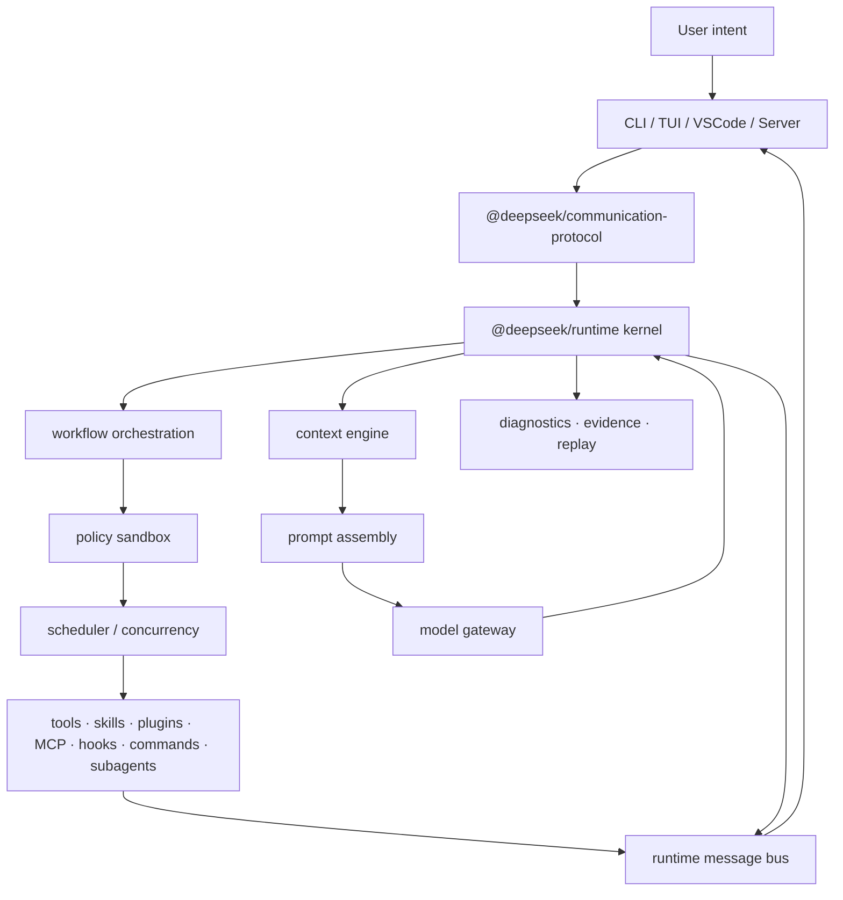

<div align="center">

# DeepSeek CLI

**Local Engineering Runtime for Coding Agents**

把 Coding Agent 从“聊天框 + 工具列表”升级为可治理、可回放、可编排的本地工程运行时。

[](https://www.typescriptlang.org/)
[](https://nodejs.org/)
[](LICENSE)
[]()

</div>

---

## 一句话

DeepSeek CLI 是面向 Coding Agent 的本地工程运行时。它用同一个 runtime kernel 编排工具、命令、技能、插件、MCP、Hook、子 Agent、上下文、缓存、权限、诊断和验证，让 Agent 的每一步都可治理、可审计、可复盘。

它不是把模型简单接到命令行；它是一个 contract-first 的 TypeScript 平台框架。CLI、TUI、VSCode 和未来 Server/SDK 都应该是 thin host adapter，共享同一套协议、运行时、能力模型和事件流。

## 官方项目说明

如果你要直接使用 DeepSeek 官方持续维护的 Agent 产品和运行时，请前往 [DeepSeek Harness](https://github.com/deepseek-ai/deepseek-harness)。它是 DeepSeek AI 官方的开源 agent harness，提供 `dsh` CLI、Web UI、headless profile、插件组合、沙箱、会话持久化、ACP、TypeScript SDK 和 Python SDK。

本仓库是独立的架构研究与实验项目，不是 `deepseek-harness` 的源码镜像，也不是官方产品的替代品。它保留了 terminal-first Workbench、evidence-first 诊断、SWE-bench 治理和 contract-first runtime 等设计探索，适合阅读、对比和二次实验；新用户不需要同时维护两套 Agent runtime。需要在官方 runtime 上定制时，优先将独有能力实现为 Harness 插件，或通过 ACP/JSON-RPC 做薄适配层。

---

## 为什么需要它

Coding Agent 真正难的地方不只是“模型会不会写代码”，而是工程系统是否能稳定地把任务做完：

| 痛点 | DeepSeek CLI 的处理方式 |
| --- | --- |
| 工具很多，但模型容易乱选 | 工具、技能、插件、MCP、Hook、命令、子 Agent 都进入统一 capability model，由 workflow 和 policy 决定可见能力与执行边界 |
| 失败原因像黑盒 | trace、diagnostics、reason code、verification evidence 会区分环境、流程、缓存、验证、harness、模型 patch、系统 bug |
| prompt 越堆越脆，cache 命中不稳定 | context pipeline 和 prompt assembly 拆分稳定前缀、动态尾部、provider cache、context projection cache 和 replay fingerprint |
| CLI、IDE、Server 各写一套状态机 | host 只负责输入输出；runtime kernel、message bus、protocol event stream 统一承载业务状态 |
| 发布和扩量容易靠感觉 | OpenSpec、lint、contract tests、golden replay、matrix、e2e、diagnostics release 共同形成证据门禁 |

核心目标很直接：让 Agent 成功率可以被工程化提升，而不是把所有失败都归因给模型能力。

---

## 适合谁

- **个人开发者**：用一个本地 CLI 入口完成代码阅读、修改、验证、诊断和上下文管理。
- **团队和企业**：把权限、沙箱、审计、诊断、发布门禁和 support bundle 做成默认能力。
- **插件和工具开发者**：把自定义能力接入统一 capability / policy / evidence / UI projection 模型。
- **评测和研究场景**：把 benchmark 当成 runtime 能力体检，分开治理 cache、prompt、测试命令、环境和模型 patch。

---

## 核心能力

### 1. 能力即 Agent

DeepSeek CLI 把 tool、skill、plugin、MCP、hook、command、subagent 都视为可编排能力。每个可执行能力都应声明身份、schema、scope、policy、sandbox、timeout、retry、audit metadata 和输入输出契约。

这让“新增一个能力”不再等于新增一条私有执行路径，而是进入统一注册、投影、调度、审计和回放体系。

### 2. Workflow Orchestration 优先

CLI 能不能完成复杂任务，关键取决于编排能力。DeepSeek CLI 将用户意图先投递给 workflow graph，再由 runtime 决定阶段、依赖、能力边界、验证门槛和修复路径。

Profile 不是一大段特权提示词，而是某个环境或任务类型的 workflow role：它组合通用能力，而不是绕过通用能力。

### 3. 受治理执行信封

每次能力调用都进入 execution envelope：

```text
intent -> preflight -> policy -> scheduler -> capability -> evidence -> replay
```

信封携带 agent、session、turn、trace、scope、sandbox、secret exposure、approval、timeout、retry、budget、audit evidence 等字段。目标是防止能力绕过权限、沙箱、审计和跨平台约束。

### 4. Prompt 和 Cache 可回放

Prompt 不是不可复盘的大字符串。DeepSeek CLI 通过 context pipeline 和 prompt assembly 生成稳定 section、prefix hash、cache hint、tool projection 和 replay fingerprint。

当 cache 命中率低时，系统应能定位是稳定前缀漂移、动态历史尾部、provider request shape、tool result projection，还是 context projection cache 本身没有复用空间。

### 5. Evidence-first 输出

事实敏感任务必须先收集本地证据，再输出结论。项目事实、命令、包名、产物、评测结论和发布声明都应能回到 evidence manifest、trace、diagnostics 或验证命令。

可见推理只展示有界摘要、证据计数、fingerprint 和 inspector target，不暴露原始 provider reasoning 或隐藏 chain-of-thought。

### 6. Diagnostics 是产品表面

`deepseek diagnostics release|doctor|verify|bundle|evaluate` 不是开发者后门，而是用户可理解的产品表面。它展示 kernel、UAPI、cache、policy、agent scope、module boundary、evidence matrix 和 release blocker。

失败要被分类、复盘、修复；只有系统性问题收敛后，才进入更大规模的评测或发布。

### 7. DeepSeek Workbench

CLI 不只是输出文本流。DeepSeek Workbench 方向包含 transcript、command bar、reasoning rail、inspector、activity feed、plugin shelf、visible prompt、vi-inspired focus keys 和 cache-aware statusline。

默认模式保持脚本友好；显式 `--tui full-screen` 才提升到 raw-key/full-screen 体验。

---

## 快速开始

### 从源码运行

```bash
npm install
npm run typecheck
npm run lint
npm test
npm run build:cli
```

常用本地命令：

```bash
npx tsx src/apps/cli/src/index.ts run "smoke" --output jsonl
npx tsx src/apps/cli/src/index.ts chat --output jsonl
npx tsx src/apps/cli/src/index.ts chat --tui full-screen
npx tsx src/apps/cli/src/index.ts context status --output json
npx tsx src/apps/cli/src/index.ts diagnostics release --output json
npx tsx src/apps/cli/src/index.ts diagnostics verify --output json
```

### 安装 CLI 包

```bash
npm install -g deepseek-agent-cli
deepseek run "smoke"
deepseek chat
deepseek diagnostics doctor --output json
```

### Live DeepSeek API

Live provider tests and smoke runs are opt-in. Keep credentials local and never commit `.env`.

```bash
DEEPSEEK_LIVE_TESTS=1 npm run smoke:live:deepseek
DEEPSEEK_LIVE_AGENT_LOOP_TESTS=1 npm run smoke:live:agent-loop
DEEPSEEK_LIVE_AUTH_TESTS=1 npm test -- tests/live/deepseek-auth-live-verification.test.ts
```

---

## 典型工作流

| 场景 | 命令 |
| --- | --- |
| 一次 one-shot agent run | `deepseek run "fix the failing test" --output jsonl` |
| 进入聊天工作台 | `deepseek chat` |
| 使用 full-screen TUI | `deepseek chat --tui full-screen` |
| 查看上下文状态 | `deepseek context status --output json` |
| 搜索 lossless context | `deepseek context grep "prior decision" --session <id> --output jsonl` |
| 查看插件贡献 | `deepseek extension plugin contributions --output jsonl` |
| 生成诊断包 | `deepseek diagnostics bundle --output json` |
| 发布前门禁 | `deepseek diagnostics release --output jsonl` |
| 验证发布阻断 | `deepseek diagnostics verify --output json` |
| 回退预览 | `deepseek revert preview --request <request-id> --output json` |

更多命令见 [src/apps/cli/README.md](src/apps/cli/README.md) 和 [docs/reference/command-index.md](docs/reference/command-index.md)。

---

## 架构一览



关键原则：

- **One Kernel, Many Hosts**：CLI、TUI、VSCode、Server/SDK 共享 runtime，不重复业务状态机。
- **One Execution Envelope**：所有能力调用都走同一治理管线。
- **One Event Stream**：text、JSON、JSONL、TUI 和未来 IDE 消费同一套 runtime events。
- **One Platform Abstraction**：macOS、Linux、Windows、WSL、CI、Remote 的差异显式建模。
- **One Quality System**：lint、contract、golden、matrix、e2e、acceptance evidence 共同约束发布。

---

## 包结构

| 层 | 包 | 责任 |
| --- | --- | --- |
| Hosts | `src/apps/cli` · `src/apps/vscode-extension` | 只做输入输出和 host adapter |
| Contracts | `@deepseek/platform-contracts` | DTO、id、envelope、error、service interface，不放实现 |
| Protocol | `@deepseek/communication-protocol` · `@deepseek/runtime-message-bus` | host/runtime 协议、事件总线、回放记录 |
| Runtime | `@deepseek/runtime` · `@deepseek/session-store` · `@deepseek/workspace-state-management` | turn lifecycle、session、checkpoint、replay |
| Capabilities | `capability-registry` · `core-coding-tools` · `command-system` · `skill-system` · `hook-system` · `mcp-gateway` · `plugin-system` | 能力注册、贡献模型、执行边界 |
| Orchestration | `workflow-orchestration` · `concurrency-orchestration` · `agent-management` · `tool-intent-preflight` | 任务图、调度、agent scope、意图归一化 |
| Governance | `policy-sandbox` · `platform-abstraction` · `config` · `credential-auth-management` · `usage-budget-management` | 权限、沙箱、跨平台、密钥、预算 |
| AI/Context | `model-gateway` · `prompt-assembly` · `context-engine` · `memory-cache-management` · `index-provider` · `code-intelligence` | provider 隔离、prompt replay、上下文、索引、记忆 |
| Quality | `testing-regression` · `tests/*` · `scripts/lint-framework` | deterministic fake、golden、matrix、lint、e2e |

---

## 当前状态

| 能力 | 状态 |
| --- | --- |
| Runtime kernel & protocol | 基础已实现，kernel boundary 和 `/proc/deepseek/*` release diagnostics 已接入 |
| CLI host | headless、JSON/JSONL、line workbench、部分 full-screen TUI 路径已具备 |
| VSCode host | skeleton/landing zone，作为 protocol consumer 推进 |
| DeepSeek provider | OpenAI-compatible gateway，有 deterministic tests |
| Prompt assembly | provider-neutral、deterministic、可回放 section pipeline |
| Context pipeline & prefix cache | immutable layers、prefix hashes、cache evidence、statusline projection 已有覆盖 |
| Evidence-first workflow | fact-sensitive runs 已接入，claim extraction 仍在扩展 |
| Visible reasoning | runtime records、text/JSON/JSONL、TUI panel 和 diagnostics policy 已接入 |
| Core coding tools | read/write/edit/search/shell/git/todo 进入 policy 管线 |
| Extensibility | 一方 dev plugin metadata pack 和 module boundary diagnostics 已接入；第三方 marketplace 延后 |
| SWE-bench governance | 用作 runtime 能力体检和失败归因治理；不宣传未验证通过率 |

边界说明：

- 不声称 VSCode、Server/SDK、插件市场已经完整发布。
- 不把 benchmark-specific 行为包装成通用能力。
- 不宣传未验证的 resolved 数量或固定 cache 命中率。
- 不公开 provider 原始推理链、密钥、隐藏 harness 内容或 benchmark 解法。

---

## Roadmap


| 阶段 | 目标 |
| --- | --- |
| R0 | contracts、gateway、scheduler、policy、tests、lint 的 runtime foundation |
| R1 | `deepseek run` 和 `deepseek chat` 能通过受治理工具完成 repo 任务 |
| R2 | context graph、memory、sandbox matrix、budget、checkpoint、secret hardening |
| R3 | skills、hooks、MCP、plugins、commands、permission diff、lockfile |
| R4 | CLI、VSCode、daemon、SDK 共享 protocol 和 session model |
| R5 | subagents、task graph、concurrency control、replayable orchestration |
| R6 | Workbench TUI、vi-inspired actions、plugin keymap/render hints、browser/native bridge |
| R7 | managed policy、audit export、signed plugins、team sync |

详见 [Product Roadmap](docs/product/product-roadmap.md)、[Competitive Matrix](docs/product/competitive-matrix.md) 和 [Roadmap To Architecture](docs/product/roadmap-to-architecture.md)。

---

## 开发门禁

非文档实现变更必须测试先行。修改 `src/**` 前，先为目标行为增加或更新聚焦的 unit、contract、regression、golden、matrix、integration 或 e2e 覆盖。Bug fix 必须先有失败回归测试；如果无法测试先行，必须先在 OpenSpec 或 acceptance evidence 中记录原因和替代验证。

常用验证：

```bash
npm run typecheck
npm run lint
npm test
node scripts/check-boundaries.mjs
```

发布或验收相关工作还应运行：

```bash
npm run build:cli
npm run smoke:headless
npm run test:contracts
npm run test:integration
npm run test:golden
npm run test:versioning
npm run test:matrix
npm run test:e2e
```

---

## OpenSpec

非平凡架构或行为变更从 OpenSpec 开始。规划、行为和实现指导类规格保持双语，并用项目自己的术语描述能力和验收边界。

```bash
openspec list
openspec validate <change-id> --strict
openspec validate --specs --strict
```

---

## 仓库规则

- 不提交 `参考/`、`.codex/`、`.deepseek/`、`node_modules/`、生成缓存、构建输出和 `.env`。
- `src/apps/cli` 和 `src/apps/vscode-extension` 保持独立 host adapter。
- 共享平台逻辑放在 `src/packages/*`。
- 跨包 API 不绕过 `@deepseek/platform-contracts`。
- `platform-contracts` 必须 implementation-free、host-agnostic。
- 优先使用 `@deepseek/runtime` 这类 package imports，避免跨包相对路径。

---

## 进一步阅读

- [Docs Index](docs/README.md)
- [System Overview](docs/architecture/system-overview.md)
- [Capability Model](docs/architecture/capability-model.md)
- [Orchestration and Scheduling](docs/architecture/orchestration-and-scheduling.md)
- [Context Pipeline Cache](docs/architecture/context-pipeline-cache.md)
- [Governance Evidence Matrix](docs/architecture/governance-evidence-matrix.md)
- [CLI Reference](src/apps/cli/README.md)
- [特色功能素材库](cli特色功能.md)

---

<div align="center">

MIT License · Copyright (c) 2026 ankye sheng

Built as a contract-first AI engineering platform.

</div>
